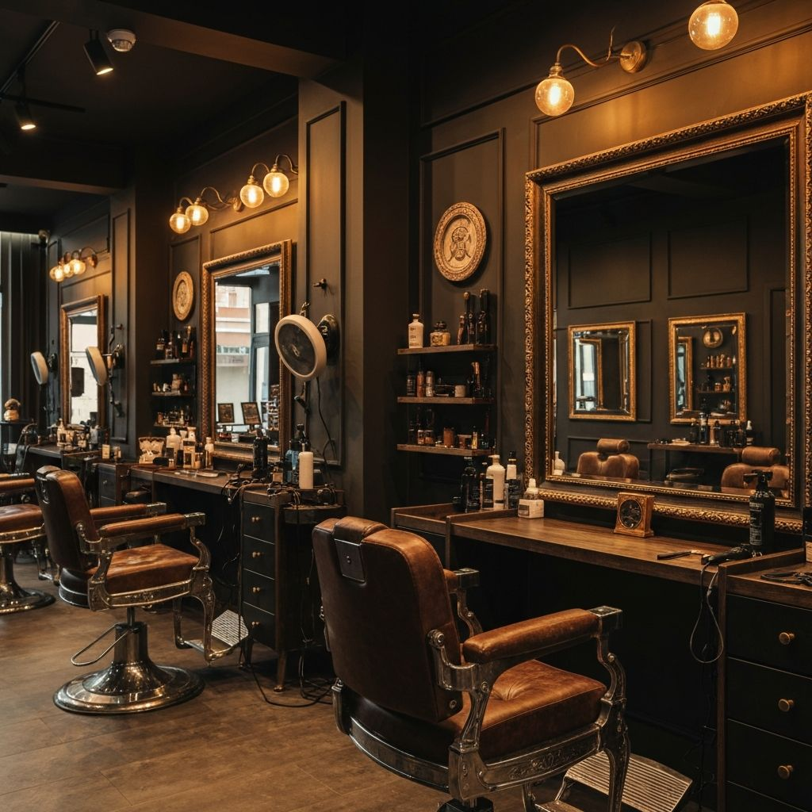

# K.M Barber - Chez Elvis 💈

Site vitrine moderne pour **K.M Barber (Chez Elvis)**, un salon de coiffure barbershop situé à Marseille, spécialisé dans les coupes classiques, afro, et l'entretien de la barbe.

Ce projet est développé avec **Next.js 16** et met en avant un design élégant et responsive pour présenter les services, la galerie de réalisations et les produits du salon.



## ✨ Fonctionnalités

- **Design Moderne & Responsive** : Interface utilisateur soignée avec un thème sombre élégant, optimisée pour mobile et desktop.
- **Galerie Interactive** :
  - Grille de photos avec effets de survol.
  - Lightbox plein écran avec navigation clavier (flèches, échap).
  - Animations fluides via **Framer Motion**.
  - Catégorisation des coupes (Waves, Locks, Dégradés, etc.).
- **Catalogue de Services** : Présentation claire des tarifs et prestations.
- **Boutique Produits** : Mise en avant des produits capillaires et d'entretien de barbe vendus au salon.
- **Prise de Rendez-vous** : Intégration de boutons d'appel à l'action pour la réservation (WhatsApp/Téléphone).

## 🛠️ Stack Technique

- **Framework** : [Next.js 16](https://nextjs.org/) (App Router)
- **Langage** : [TypeScript](https://www.typescriptlang.org/)
- **Styling** : [Tailwind CSS](https://tailwindcss.com/)
- **Composants UI** : [shadcn/ui](https://ui.shadcn.com/) (basé sur Radix UI)
- **Animations** : [Framer Motion](https://www.framer.com/motion/) & Tailwind Animate
- **Icônes** : [Lucide React](https://lucide.dev/)
- **Polices** : Playfair Display (Titres) & Inter (Corps)

## 🚀 Installation & Démarrage

Suivez ces instructions pour lancer le projet en local.

### Prérequis

- Node.js 18+ installé
- pnpm (recommandé) ou npm/yarn

### Étapes

1. **Cloner le dépôt**
   ```bash
   git clone https://github.com/votre-username/km-barber.git
   cd km-barber
   ```

2. **Installer les dépendances**
   ```bash
   pnpm install
   # ou
   npm install
   ```

3. **Lancer le serveur de développement**
   ```bash
   pnpm dev
   # ou
   npm run dev
   ```

4. **Accéder au site**
   Ouvrez [http://localhost:3000](http://localhost:3000) dans votre navigateur.

## 📂 Structure du Projet

```
km-barber/
├── app/                  # Pages et Layouts (App Router)
├── components/           # Composants React
│   ├── ui/               # Composants réutilisables (shadcn/ui)
│   └── ...               # Composants spécifiques (Hero, Gallery, etc.)
├── lib/                  # Utilitaires et helpers
├── public/               # Assets statiques (images, fonts)
└── styles/               # Styles globaux
```

## 📝 Personnalisation

- **Couleurs & Thème** : Modifiez les variables CSS dans `app/globals.css`.
- **Contenu** : Les textes et données sont principalement dans les composants respectifs ou dans `lib/` (ex: `products.ts`).
- **Configuration** : Ajustez `tailwind.config.ts` pour les tokens de design.

## 📄 Licence

Ce projet est sous licence MIT. Voir le fichier [LICENSE](LICENSE) pour plus de détails.
